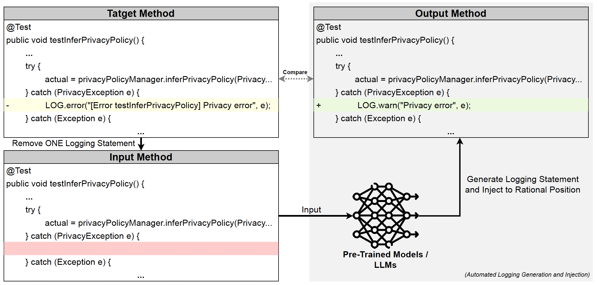
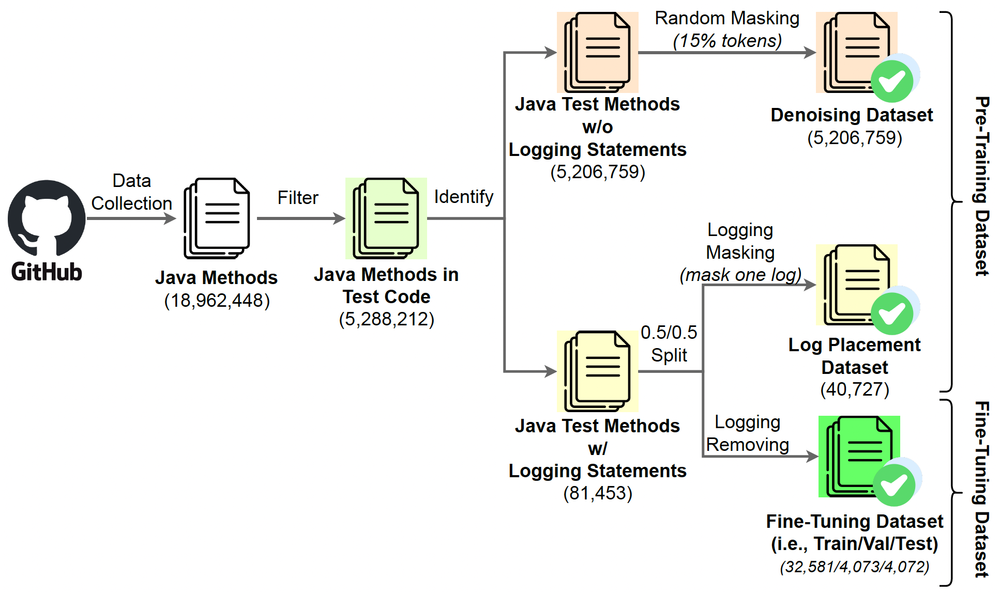
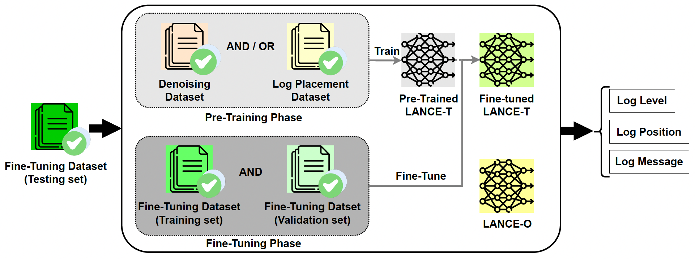
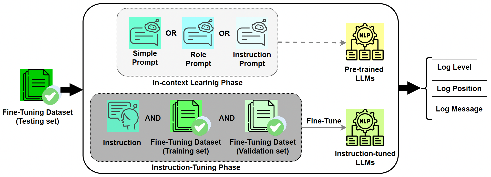
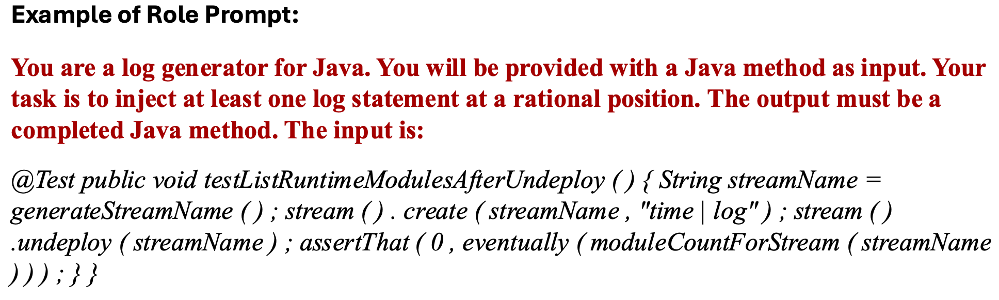
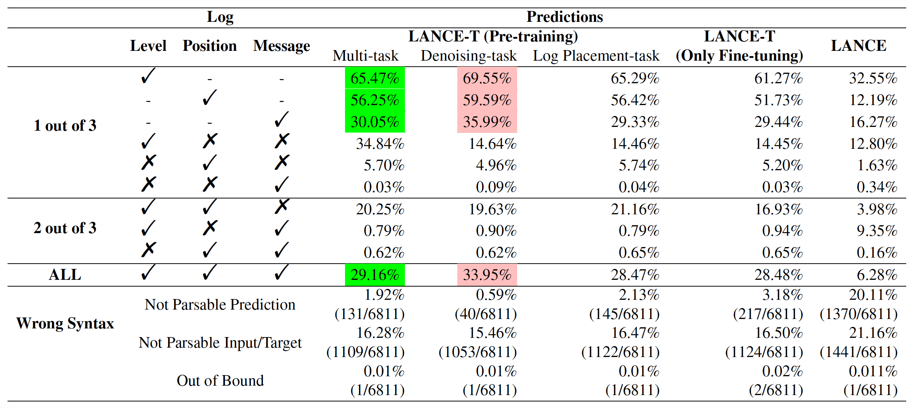
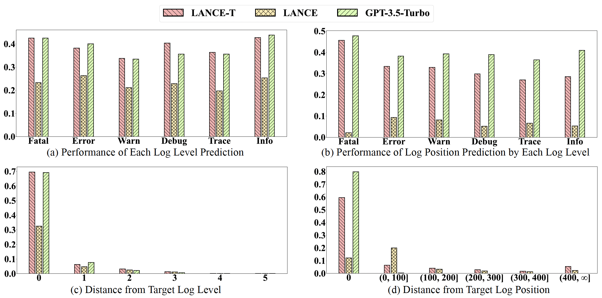
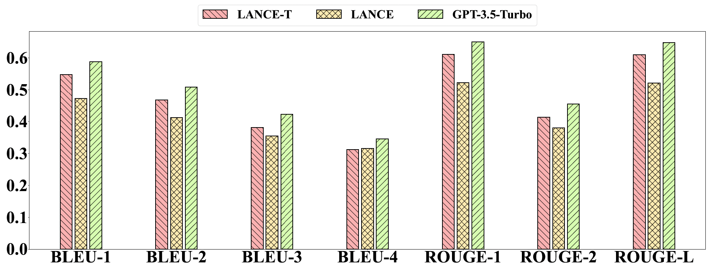

# Exploring the Effectiveness of Generating Log Statements in Test Codes

In this study, we empirically investigate various logging-specific PLMs and general-/code-specific LLMs with different learning strategies (e.g., in-context leraning, instruction tuning) for generating test log statements. This is a replication package for our empirical study.

## Envirnoment Requirement (Local)
* Python 3.7.7
* PyTorch 1.13.1+cu117
* Sciki-learn 1.2.2
* Transformers 4.37.0.dev0
* TRL 0.7.11
* Numpy 1.18.1
* Pandas 1.3.0
* Matplotlib 3.4.2
* Openai 1.2.3
* Tiktoken 0.7.0
* Tqdm 4.66.5

## Dataset

The dataset for pre-training, fine-tuning/instruction-tuning (train, val, and test set), and in-context learning can be found as this link:  https://drive.google.com/drive/folders/1FZDgEmfvIMGZ8llL43fv1BoqreYc_PNV?usp=sharing

## How to experiment with logging-specific PLMs

In this experiment, we mainly focus on the automatic logging generation technique, [LANCE](https://github.com/antonio-mastropaolo/LANCE?tab=readme-ov-file), a T5-based approach for supporting the task of log statement generation and injection. In this case, we mainly use Google Colab to implament original LANCE and LANCE-T (a variant LANCE version for test logging generation). Please provide your own google account with Colab membership for excuting the code and also store the dataset in Google Cloud Storage.

* **Pre-trained Tokenizer for LANCE/LANCE-T**  
  Tokenizer is important for accomodating the expanded vocabulary given by the Java programming language. In this case, please use the following tokenizer for LANCE or LANCE-T: https://github.com/SpanShu96/Empirical-Test-Logging-Generation/tree/main/Tokenizer
  
* **Setup a Google Cloud Storage (GCS) Bucket**  
  To setup a new GCS Bucket for pre-training and fine-tuning the LANCE-based Model, please follow the original guide provided by Google: https://cloud.google.com/storage/docs/quickstart-console  

* **Inference for LANCE**  
  Regarding inference the original LANCE on test code, please use the following: https://github.com/SpanShu96/Empirical-Test-Logging-Generation/tree/main/Models/LANCE
    
* **Pre-training/Fine-tuning for LANCE-T**  
  Regarding pre-training and fine-tuning the LANCE-T, please use the following: https://github.com/SpanShu96/Empirical-Test-Logging-Generation/tree/main/Models/LANCE-T

## How to experiment with general-/code-specific LLMs

In this experiment, we mainly focus on two categories of the automatic logging generation technique: (1) general-specific LLMs (GPT-3.5-Turbo/GPT-4o), and (2) code-specific LLMs (Code Llama). For running the general-specific LLMs, you should prepare your own OpenAI account and API KEY. For running the code-specific LLMs, we recommend using GPU with 48 GB (at least) up memory for training and testing, since they are computing intensive.

#### Regarding to GPT-3.5-Turbo/GPT-4o  
* **In-context Learning**  
  Regarding applying simple prompt/role prompt/instruction prompt on GPT-3.5-Turbo/GPT-4o, please use [this code for GPT-3.5-Turbo](https://github.com/SpanShu96/Empirical-Test-Logging-Generation/blob/main/Models/GPT-3.5-Turbo/GPT-3.5-Turbo_ICL.ipynb) and [this code for GPT-4o](https://github.com/SpanShu96/Empirical-Test-Logging-Generation/blob/main/Models/GPT-4o/GPT-4o_ICL.ipynb).
  Here is a example of role prompt:  
  

* **Insturction Tuning**  
  Regarding fine-tuning GPT-3.5-Turbo with instruction, please use the following: https://github.com/SpanShu96/Empirical-Test-Logging-Generation/blob/main/Models/GPT-3.5-Turbo/GPT-3.5-Turbo_Insturction-Tuning.ipynb

#### Regarding to Code Llama  
* **In-context Learning**  
  Regarding applying simple prompt/role prompt/instruction prompt on Code Llama, please use the following: https://github.com/SpanShu96/Empirical-Test-Logging-Generation/blob/main/Models/CodeLlama/CodeLlama_ICL.ipynb
* **Insturction Tuning**  
  Regarding fine-tuning Code Llama with instruction, please use the following: https://github.com/SpanShu96/Empirical-Test-Logging-Generation/blob/main/Models/CodeLlama/CodeLlama_Instruction-Tuning.ipynb

## Additional
  Under [Miscellaneous](https://github.com/SpanShu96/Empirical-Test-Logging-Generation/tree/main/Miscellaneous), you can find the additional script used for the data analysis in our study.
  
## Results
**1) The performance of PLMs on Test Log Statement Generation**

--- ---

**2) The performance of LLMs on Test Log Statement Generation**

--- ---

**3) The performance of Each Log Level Prediction (F1-score), Performance of Log Position Predictions by Each Log Level (Accuracy), and Distance from Target Log Level and Position, across studied PLMs and LLMs**

--- ---

**4) Performance of Test Log Statement Generation on 7 Machine Translation Metrics across Studied PLMs and LLMs**

--- ---

## Appendix
**1) The evaluation results of 16 variant models of LANCE-T**

--- ---
